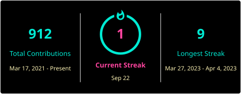

<h1 align="center">👋 Hi, I’m @vmose</h1>
<h3 align="center">Analytics Engineer | BI Developer | Cloud Analyst</h3>
<ul align="center">
   <li>🌟 I’m interested in data pipeline engineering, BI development & deployment</li>
   <li>🌱 I’m currently learning Google Cloud Frameworks.</li>
   <li>💞️ I’m looking to collaborate on works involving Data Warehousing & Cloud Automation</li>
   <li>📫 How to reach me vicmose.vm@gmail.com</li>
</ul>

<h2>My Stats</h2>

  

  

<!---
vmose/vmose is a ✨ special ✨ repository because its `README.md` (this file) appears on your GitHub profile.
You can click the Preview link to take a look at your changes.
--->

